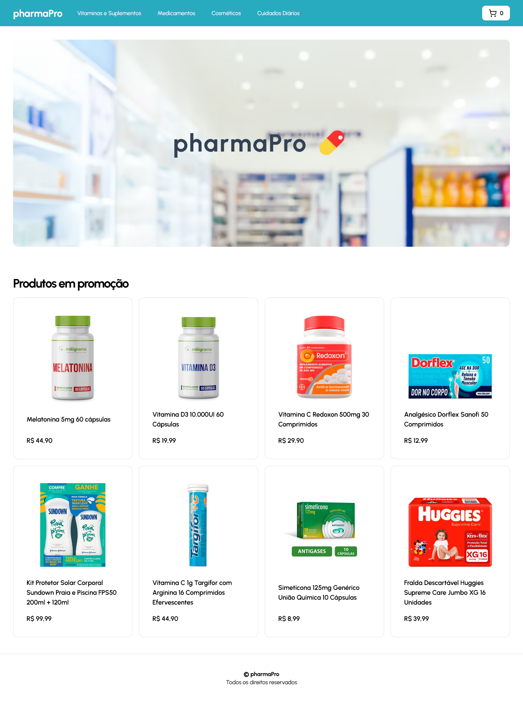

# pharmaPro Store 

> E-commerce para farmácias

### Ajustes e melhorias

Projeto concluído!

- [x] Desenvolvimento de todo o projeto utilizando NextJS e Tailwind
- [x] Páginas responsivas e máscaras de loading
- [x] Consumo de REST API
- [x] Utilização de Stripe como meio de pagamento
- [x] Comunicação com a dashboard do projeto [pharmaPro Admin](https://github.com/gguilhermelopes/pharmapro-admin), podendo gerenciar totalmente a farmácia pelo Admin

## 💻 Pré-requisitos

Antes de começar, verifique se você atendeu aos seguintes requisitos:

* Você instalou a versão mais recente de `Node.js` e `npm`.

## 🚀 Instalando pharmaPro Store 

Para instalar o pharmaPro Store , siga estas etapas:

* Clone esse repositório com `git clone https://github.com/gguilhermelopes/pharmapro-store`
* Entre na pasta com `cd dogs`
* Instale as dependências com `npm install`
* É necessário um arquivo de váriaveis de ambiente (.env) como no exemplo abaixo

  `NEXT_PUBLIC_API_URL="url_da_api"`

## ☕ Usando pharmaPro Store 

Para usar pharmaPro Store, siga estas etapas:

* Certifique-se de que todas as dependências foram instaladas, que o arquivo .env esteja configurado corretamente e que esteja na pasta do projeto. Utilize `npm run dev` e veja em qual porta do seu ambiente local ele foi executado.
